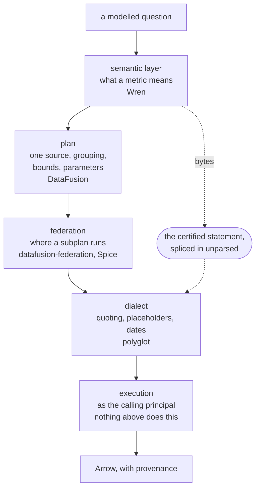

# Architecture

This page is the settled design and the reason the repository is laid out the way it is, not an
inventory of what compiles. [What exists today](#what-exists-today) is that inventory, and it is
short. `AGENTS.md` in the repository root holds the crate table and the invariant table; this
page says why they look the way they do.

## Serving is MCP

The primary interface is an MCP server, so an agent is a first-class client rather than an
afterthought wrapped around an API built for a dashboard.

That makes the tool surface the governance boundary, and it is deliberately narrow. No tool takes
SQL, a table name, a filter expression or a list of row ids. A question names a metric, some
dimensions and a time range, and there is no field into which anything else fits. An uncertified
question is unrepresentable rather than refused: a refusal can be retried until it succeeds, and an
absent field cannot.

The tool schemas are derived from the domain types rather than written by hand, so widening the
surface changes a generated schema and shows up in the diff of the review that widened it.

An HTTP surface sits beside the MCP one for callers that are not agents: a second transport over the
same service, derived from the same types, so it cannot accept a question the MCP surface would
reject.

## Metadata sources are behind a port

Metrics, dimensions, the glossary and lineage come from a catalogue, and `SemanticCatalog` is the port
they arrive through: one trait, implemented once per catalogue. A directory of documents in git and a
metadata catalogue with an HTTP API are two adapters behind it, and swapping one for the other does
not touch the query path.

The catalogue may be outside this repository or in it, and
[the first-party models decision](adr/0001-first-party-semantic-models.md) is why both are allowed. What the port
guarantees is the same either way.

Two properties of that trait carry the weight:

- `load` takes no request context. A catalogue cannot see who is asking, so it cannot return a
  different definition to different callers, and a tampered catalogue cannot select what executes.
- Definitions arrive as a pinned, hashed snapshot. Arguments are validated against the bundle rather
  than a live read, so a catalogue edit cannot change what a question means between two invocations.
  It changes the digest, and the digest travels with the answer.

Nothing here edits a definition that arrived rendered. Editing one forks it from the number it
certifies, which was the only thing certifying it bought. A first-party model is a different case: it
is authored here, so reviewing a change to it is reviewing what will execute, and that review belongs
in the same pull request as any other change to behaviour.

## The engine, and the data systems behind a port

Two different things, and conflating them is the mistake this section exists to prevent.

**The engine is one thing: DataFusion, with `polyglot-sql` rendering SQL when a query is pushed down.**
Not one engine per data system, and not a second engine kept in step with a first. It executes what it
must locally over Arrow, and it is where a plan becomes rows.

**A data system is a place data already lives** - DuckDB, Postgres, ClickHouse, BigQuery - that
somebody wants queried. Those sit behind the `Warehouse` port. What differs per data system is
dialect, connection and how an identity is presented; neither the plan nor what a metric means
differs, because [the semantic compiler](#the-semantic-compiler) decides both.

**The port carries a plan, not a rendered statement**, and that is load-bearing rather than tidy.
Taking a statement asserted that every data system speaks SQL. The engine does not: it executes a
logical plan over Arrow and never sees a string. So the plan is the contract and rendering is the
adapter's private business, which is what makes an adapter possible that cannot have a dialect bug,
because it emits no dialect. [DataFusion for local execution](adr/0003-datafusion-for-local-execution.md)
is the record.

### Where the engine sits, and where it is going

Today the engine is *behind* the port, as one adapter among the others, executing local files. That is
a stepping stone and worth naming as one: an engine belongs **above** the port, deciding which subplan
each data system runs and executing the remainder itself. That is what federation means here, and it
is the shape the surveyed projects converge on. Today's arrangement is the engine with zero remote
sources.

### Connectors: Arrow Flight, not a driver per data system

The intended transport to a data system is **Arrow Flight SQL**, uniformly - DuckDB, Postgres and
BigQuery alike - rather than a linked native driver each.

Three reasons, and the third is the one that shows up as code today. Arrow is already the result
format, so a Flight response needs no row-by-row conversion. A Flight endpoint is reachable without
compiling a C library, which is what makes a statically linked artifact possible at all. And a driver
per data system means a *type mapping* per data system: the two adapters that exist already had to
decide independently what a boolean and an exact decimal become, and they agreed only because one was
written while reading the other. One wire format decides that once.

Taken seriously, that reaches back into the port. Results leave sutura as Arrow with provenance in
the schema metadata, and a Flight response arrives as Arrow, so a row-oriented type in the middle is
a conversion in and a conversion out for no benefit. The `RowSet` and `Value` the port returns today
are exactly that middle, and the cost is already visible: two adapters had to decide independently
what a boolean and an exact decimal become.

The obstacle is the one the layout exists to enforce - the domain may not name a framework, and
`arrow` is one. The way through is that **Arrow IPC is a serialization format, not a library type**: a
port can return encoded bytes plus the provenance that must travel with them, which is lossless,
names no framework, and makes Arrow the format end to end. `sutura-arrow` then owns encode and decode,
and anything wanting typed values - the table a CLI prints - becomes a consumer of it rather than of a
bespoke row type.

Not built. `RowSet` is what exists, and it is honest about being a row type. Recorded here because the
direction decides whether it grows a `Boolean` variant and an exact decimal, or is replaced.

Until then a data system's driver is a **development dependency** - present to prove that the SQL we
render actually runs, which is a real job and the reason a data-system adapter exists at all today.
It is not in the shipped binary, and the shipped binary is not poorer for it: the engine reads CSV and
Parquet itself.

A plan resolves to exactly one data system. Federation across two is not a smaller version of the
same problem, it is a second identity to satisfy, and a plan that cannot run as one subject in both
places is refused rather than run partly as somebody else.

## Security is the reason for the shape

The three sections above are not features arranged around a core. They are what falls out of one
requirement: an agent may be handed a database only if the database can still tell who is asking.

**The caller's identity reaches the data system.** Not a service account holding the union of
everyone's access. A credential is minted per request, and a request that cannot run as the subject
is refused rather than downgraded to the service's own identity: that downgrade turns "you may not
see these rows" into "here are the rows". A row-level security policy that holds only for human
callers is decorative.

**Authorization stays in the data system.** sutura keeps no copy of who may see what, because a copy
can disagree with the original. Grants, row-level policies and masking already exist in ClickHouse
and Postgres, administered and audited by the people who own the data; a second implementation here
would produce a second answer and no way to tell which is right. One consequence: there is no result
cache, because under row-level security a cache keyed on the query text is a cross-user leak.

**A narrow tool surface bounds a compromised agent.** The input is natural language from wherever
the user found it, so a manipulated agent is the expected case and the defence is not detecting it.
The most an attacker can make the agent emit is a different certified question, asked as the same
caller, over the same pinned definitions, against the same authorization. The blast radius of a fully
manipulated agent is the set of questions its caller could already ask.

**Returned content is untrusted input.** Rows, column descriptions and glossary text are authored by
somebody else, and any of it can contain something shaped like an instruction. A delimiter cannot
separate instruction from data, because the content can contain the delimiter, and neither can a
preamble announcing that what follows is untrusted. So the boundary is a constraint on the wire
format: results leave as Arrow with provenance in the schema metadata, a typed field a caller reads
deliberately rather than a string concatenated into the channel that carries instructions.
Descriptive text from the catalogue travels the same way, and both envelopes share one encoder, so
neither transport can grow a text-blob shortcut on its own.

## The semantic compiler

`sutura-semantic` turns a modelled question into one statement for one data system. It exists, in
three modules named after the three stages below.

A question names a metric, some dimensions, a grain and a bounded time range. Dimension values are
arguments, checked against an allowlist in the pinned bundle. What comes out is a statement and
the values bound to it. Nothing in between is text a caller wrote.

**Resolve.** Every name in the question is looked up in the pinned snapshot: the metric has to exist,
each dimension has to be one that metric declares, the grain has to be one it supports, the range has
to be bounded. The lookup never goes to a live catalogue read, which is what makes the answer
independent of what the catalogue says at the moment of asking. The output is a set of definitions, or
a refusal naming the argument that failed.

**Plan.** The resolved question becomes a plan: which data system owns the metric, the projection, the
grouping keys, the date predicate and its bounds, and which values become bind parameters. Two things
are settled here and nowhere else. The plan names exactly one source, so a question that would need
two identities is refused before anything runs. And every value from the question becomes a parameter,
so no caller-supplied value reaches the next stage as text. The plan also records where each predicate
came from, definitional or requested, because a predicate that is part of what a metric means is not
one a caller chose and must not be removable. The plan holds no SQL, its type is a domain type because
[the execution port carries it](#data-systems-are-behind-a-second-port), and its serialized form is
what a golden snapshot pins.

**Generate.** The plan becomes one statement in one dialect, which decides identifier quoting,
placeholder syntax, date arithmetic and how an aggregate is spelled. This is the only stage that emits
SQL, and an adapter that executes a plan directly never reaches it.

### Two ways a definition arrives

The stages above are the same either way. What differs is who wrote the statement.

**A first-party model.** The catalog declares models, relationships and metrics, and the generator
produces the whole statement from them. This is the path that is built, and
[The first-party models decision](adr/0001-first-party-semantic-models.md) is the record: it exists because the spliced
path below has a precondition - something upstream must already have rendered dialect-correct SQL -
and on a laptop, or over a single file, there is no upstream to have done it.

Its load-bearing constraint is that **a model may not contain a free-text SQL expression.** A measure
is one of three closed shapes - one aggregate over a named column, a conditional count, or a ratio of
two aggregates over possibly different columns; a relationship is a pair of columns and a join type; a
dimension is a column, optionally one declared relationship away. A metric may also carry required
filters, predicates from a closed set of four operators that are **part of what the metric means
rather than something a caller asks for**: they are applied to every question about it, and a caller
cannot see, choose or remove one.
[A closed vocabulary for measures](adr/0002-a-closed-vocabulary-for-measures.md) is the record of why
the vocabulary is a closed set of *shapes* rather than a single aggregate. The property being defended
was always no free-text SQL, and one aggregate over one column was a narrow means to it that could
express two of a real semantic layer's seven metrics.

The cost is unchanged: an expression over two columns cannot be said, and neither can a window
function. Those belong on the other path.

**A pinned statement**, rendered upstream and taken as given, spliced into a generated wrapper. Not
built. The rest of this section is its design.

### The splice

The certified statement is spliced into that wrapper as a derived table, byte for byte, without
being parsed. It is the decision that separates this from a SQL generator.

The statement arrives as text with a digest. sutura puts it in the `FROM ( ... )` position and
generates around it. It does not read it, rewrite it, transpile it, or push a predicate into it.

Parsing it would mean re-emitting it, and re-emitting substitutes our reading of the statement for the
author's. Every round trip through an AST is a chance to change the number quietly: a window frame
read slightly differently, a null ordering normalized, an implicit cast made explicit. The digest
covers the text we were handed rather than the SQL we produced, so it would not move, and the change
would be invisible in the one place this design exists to make visible.

Three costs follow:

- Nothing is optimized across the splice boundary. A predicate in the wrapper filters the
  statement's output, not its input.
- The statement's column types are unknown without asking the data system.
- The statement has to be valid in the dialect it will run in, which makes the data system part of
  what the definition means rather than a deployment choice.

It remains implementable exactly as described: the dialect layer has a verbatim passthrough node
whose generator appends the text unchanged, which no dialect pass rewrites and which has no children
for a transform to descend into. What is missing is a reason to build it, which arrives with the first
upstream renderer.

### What holds the generated statement up

Goldens per dialect, regenerated and reviewed as a diff rather than typed, over a corpus of questions
that includes one per refusal. Beside them, four checks that are assertions rather than snapshots:

- **No literal from a question appears in the statement.** Every value is a bind parameter, and the
  parameter list is asserted to be exactly the set of literals the question carried - so a generator
  that dropped the predicate fails it too.
- **Every identifier and alias is quoted**, so a column called `order` is not a syntax error.
- **Every statement parses in the dialect it was generated for.** Parse only, never re-emit: that is
  what makes it safe, and it is what replaces having one of each data system in CI.
- **Every declared anchor re-executes and reproduces its number**, and a bundle whose anchors were not
  all checked cannot be served, because there is no constructor that produces one.

The gap this page used to record - that no lint banned a transpile call on the query path - is closed
differently and better: the dialect layer's `transpile` feature is not compiled, so a call to it does
not build.

## Where the parts come from

The same line runs through every system of this kind: **semantic layer, plan, federation, dialect,
execution**. The projects worth reading sit at different points on it. The last stage is the one
none of them covers.



**The semantic layer decides what a question means.** [Wren](https://github.com/Canner/WrenAI) is
the reference for that shape: a modelling language, an engine that plans against it, and MCP as the
way an agent asks. Wren derives a metric's SQL from a model of the tables; we take the statement as
given and refuse to look inside it, which is a narrower job and a different guarantee. Wren also
carries access rules in the model, which is the middle-tier policy copy
[this design declines to keep](#security-is-the-reason-for-the-shape).

**The plan is where a question stops being text.** [DataFusion](https://datafusion.apache.org/) is
what Wren and Spice both build on: a logical plan representation, an optimizer you extend with
rules, and execution over Arrow. The plan is still our own type, and it now lives in
`sutura-domain`, which names no framework - not tokio, not arrow, not datafusion - so it cannot be
DataFusion's. What earned DataFusion its place is the execution stage rather than this one, and not
the SQL frontend either way: over a local file it executes a plan and emits no SQL, which is a whole
class of dialect bug that cannot occur there.
[DataFusion for local execution](adr/0003-datafusion-for-local-execution.md) is the record.

**Push-down already happens, and completely - federation is not what buys it.** Worth stating plainly,
because "federation pushes the query down" invites the assumption that without it we pull rows up and
filter locally. We do not. A plan is rendered as one statement carrying the join, the bounded
predicate, the grouping, the ordering and the row cap, and the data system returns the finished
aggregate. Nothing comes back that was not asked for, and there is nothing left here to re-authorize -
which is the security property, not a performance one: the predicate is evaluated under the caller's
own grants, row-level policies and column masking, by the system that owns them.

**What federation adds is a SECOND source, and that is a security question rather than a capability
one.** [datafusion-federation](https://github.com/datafusion-contrib/datafusion-federation) registers
an optimizer rule that finds the largest subplan a single remote source can execute, hands it there,
and combines the results. That is exactly what a plan spanning two data systems needs - and a plan
spanning two data systems is refused today
([one data system per plan](#the-engine-and-the-data-systems-behind-a-port)) because it is a second
identity to satisfy, not because we cannot compute it. Pull the rows up and join them here and the
filtering becomes ours, which is the second policy implementation this design declines to keep. So
federation arrives after a credential exists per leg. The blocker is identity, not the optimizer.

Two practical notes for when it does arrive. Its push-down renders the remote SQL with DataFusion's
own unparser, which is the path
[the splice section](#what-holds-the-generated-statement-up) deliberately avoids - adopting it means
either accepting that renderer for the pushed-down half or supplying one that uses `polyglot-sql`.
And there is real version skew between the crate and current DataFusion, which is a second and much
smaller reason it is later rather than now.

**The dialect stage is one plan and many adapters.**
[polyglot](https://github.com/tobilg/polyglot) is a Rust transpiler between more than thirty SQL
dialects, MIT-licensed, ClickHouse, Postgres and DuckDB among them. The wrapper is exactly its shape
of problem: a projection, a `GROUP BY` and a date predicate, rendered per data system. It must not
touch the splice, because a transpiler is a parse followed by a re-emit. Today that boundary is a
review rule, not a lint.

**Execution is where the caller's identity has to arrive.**
[Spice](https://github.com/spiceai/spiceai) comes closest to everything above it: Rust,
Apache-2.0, DataFusion-based, federating across thirty-odd connectors and accelerating them by
materializing into Arrow, DuckDB, SQLite or Postgres. The federation half is what we want, and
better exercised than anything we will write soon. The acceleration half we cannot take: a
materialized copy is read under whoever refreshed it, so under row-level security it is a cross-user
leak with a refresh schedule. Spice's front door is also SQL, where ours has no field for it.

| Stage | Decided there | Ours or theirs |
| --- | --- | --- |
| Semantic layer | what a metric means | Both, by two routes. A first-party model is authored here and compiled; a rendered statement is authored upstream and taken as given. Wren is the reference shape for the modelling half, and the difference is that a model here may hold no SQL expression |
| Plan | source, projection, grouping, bounds, parameters | Ours, and the prediction this row used to make came true from the other side. The type is still ours and it moved into `sutura-domain`, because the execution port carries a plan rather than a statement; DataFusion arrived for execution rather than for representation. [DataFusion for local execution](adr/0003-datafusion-for-local-execution.md) |
| Federation | which subplan its owner runs | Adopt for a SECOND source, once a credential exists per leg. Not needed for the first: a single-source plan is already pushed down whole |
| Dialect | quoting, placeholders, date arithmetic | Adopt for what we generate, never for the splice. Two things it does not decide: placeholder style, which it renders identically for every target, and quoting, which it applies only when asked. Both are ours |
| Execution | the connection, and which principal the data system sees | Build, and adopt for the local leg: one adapter per data system, DataFusion where the data is a file on the same machine, and the per-request credential is the part nothing above provides |

That last row is why this is a repository rather than a configuration file for one of the others.

## Hexagonal by construction

Ports live in the domain crate. Adapters live outside it. The domain crate depends on neither: it
names what it needs by trait, and the binary decides which implementation is passed in.

```text
        agent                        other callers
          |                                |
      MCP server                     HTTP / OpenAPI          transport, no logic
          +----------------+----------------+
                           |
                      sutura-app                             the service, generic over ports
                           |
                     sutura-domain                           domain types + port traits
          +----------------+----------------+
          |                |                |
   SemanticCatalog     Warehouse     CredentialBroker        ports, inside the hexagon
          |                |                |
    YAML in git,      ClickHouse,      the identity          adapters, outside it
    a metadata        Postgres,          provider
    catalogue         DuckDB,
                      DataFusion
```

`cargo xtask check-boundaries` enforces the direction, so the diagram cannot quietly stop being true.
It fails if `sutura-domain` acquires a framework dependency anywhere in its transitive tree, which
catches a framework reached through an innocuous crate as well as one declared outright. It fails
again if a library crate's surface stops being a typed contract: a `pub` field on a `pub struct`, a
`Result` whose error type is `String`, or a declared dynamic-error crate such as `anyhow`.

Two consequences follow from the direction rather than from taste. The domain names no framework, so
its test suite compiles nothing heavy and runs in well under a second, which is what makes it the
inner loop. And adapters are feature-gated and default-off, which is why every lint and test entry
point passes `--all-features`; [Contributing](contributing.md) has the commands.

## What ships

Four artifacts, two libc flavours on two architectures, each a distroless image holding one
binary. `cargo xtask check-workflows` fails if a workflow names a build output that does not
exist, and the `one-binary` check fails if an image carries more than the binary.

The musl artifacts replace the system allocator. musl's mallocng serialises the whole process on one
lock word: `src/malloc/mallocng/glue.h` defines `rdlock` and `wrlock` as the same exclusive lock and
`upgradelock` as a no-op, and `struct malloc_context` is a single global with no arenas and no
per-thread cache.

Measured with one binary and only threading toggled, the single-threaded control is a wash across all
three. A 48-core run is not:

| Build | 48 threads |
| --- | --- |
| glibc | 4.45s |
| musl, mallocng | 92.16s |
| musl, mimalloc | 3.83s |

92.16s is slower than musl's own single-core run, which is what one global mutex predicts. Expect
parity single-threaded and a 4-20x gap for a threaded application.

mimalloc is built with `MI_SECURE=4`: guard pages, randomised placement, encoded free lists,
double-free detection. That costs 23-43% against plain mimalloc, far more than upstream's README
claims. mimalloc-secure still lands ahead of glibc and well ahead of mallocng, and the latency
budget here is a warehouse round trip.

## What exists today

The query path is built, for one shape of catalog and one data system.

`sutura-domain` holds the domain types, the query plan and two port traits, `SemanticCatalog` and
`Warehouse`; `sutura-catalog-local` reads a directory of markdown documents with YAML frontmatter;
`sutura-semantic` resolves, plans and generates; `sutura-exec-duckdb` executes; `sutura-app` is the
service, generic over both ports; `sutura-cli` composes them. `xtask` holds the repo gates and
`sutura-dev` the local development CLI. `sutura-exec-datafusion` is **in progress**: a second
`Warehouse` adapter for the local path, which executes the plan over Arrow and renders no SQL at all.

What that adds up to: a question naming a metric, a grain, a bounded range, up to four dimensions and
a filter compiles to one statement, in `DuckDB`, Postgres or `ClickHouse` dialect, and executes
against a `DuckDB` file. A measure may be one aggregate over a column, a conditional count or a ratio
of two aggregates, and a metric may carry required filters that every question about it is answered
under. Every metric that declares a certified number re-executes and reproduces it before the bundle
can be served, and a bundle whose anchors were not checked cannot reach the query path because there
is no constructor that produces one.

**`CredentialBroker` is still absent, and it is the one that matters most.** DuckDB is a file with no
login, so "every query runs as the calling principal" is satisfied here by there being nobody else to
be. That is a true statement about a laptop and not about a warehouse: per-request identity arrives
with the first data system that has grants to run under, and until then this is a compiler with a
governed front door rather than the identity-aware runtime the rest of this page describes.

Also absent: the MCP and HTTP transports, Arrow results with provenance in the schema metadata,
federation, a budget beyond a hard row cap, a second catalog adapter, and the audit sink. The
spliced-statement path is designed, documented above, and unimplemented.

The mechanisms came first on purpose, and that has not changed: every claim on this page is meant to
be held up by a type, a lint, a hook or a gate rather than by intent, and a mechanism is cheaper to
build before there is code to retrofit it onto.
