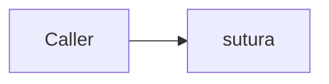

# Publishing the docs

Every version of this site stays published. `main` has a directory, each release has its own, and a
URL somebody cited a year ago still resolves to the text they read.

That is [mike](https://github.com/jimporter/mike)'s job. `.github/workflows/docs.yml` builds the site
with mkdocs-material and hands it to mike, which owns the `gh-pages` branch: the version directories,
`versions.json`, the root redirect and the `.nojekyll` marker. The header's version selector is
Material's own, driven by `extra.version.provider: mike` in `mkdocs.yml`.

Both tools come from pixi's isolated `docs` environment, so a local build uses the versions CI does
and there is no pip and no npm in the path.

## The layout mike produces

```text
gh-pages/
  index.html      redirect to the default version, written by `mike set-default`
  versions.json   the list the header's version selector reads
  .nojekyll       Pages runs Jekyll over a branch, and Jekyll drops `_`-prefixed paths
  latest/         alias, moved onto each release - HTML redirects, one per page
  0.2.0/
  0.1.0/
  main/           the development docs, overwritten on every push to main
```

| Event | Deploys | Alias |
| --- | --- | --- |
| push to `main` | `main/` | none. `latest` stays pinned to the newest release |
| push of a `v*` tag | `<version>/`, the `v` stripped | `latest` moves onto it, and the root redirect follows |
| `workflow_dispatch` from `main` | `main/` | none |
| pull request | nothing | builds with `--strict`, so a broken link or an orphan page fails the PR |

Nothing deletes a version directory, and the publish never force-pushes. A concurrent publish makes
the job fail rather than overwrite: a failed job is recoverable and a deleted version is not.

The root redirect points at `latest` once a release exists. Before the first release the workflow
sets the default to `main`, so the site has a working root from the first deployment rather than
from the first tag.

## The one repository setting

Publishing works from a cold start, because mike creates `gh-pages` itself when it is absent.
*Serving* needs one manual step that no workflow can perform. In **Settings -> Pages -> Build and
deployment**:

- **Source: Deploy from a branch**
- **Branch: `gh-pages`, folder `/ (root)`**

The site then answers at <https://telekom.github.io/sutura/>.

!!! warning "The branch has to exist first"

    The dropdown lists only branches that are already there, so let the `docs` workflow run once
    before looking for `gh-pages` in it. A push to `main` touching any documentation path does it,
    and so does a manual `workflow_dispatch`.

Do not pick **GitHub Actions** as the source. It serves one uploaded artifact as the whole site: one
current version, no history, no version directories. It is also the source that fails a deployment
with a bare `HttpError: Not Found` while Pages is switched off. The branch source has neither
property, so the publish succeeds whether Pages is on or not.

Until the setting is made, versions accumulate on the branch and the site answers nothing. That state
is visible and recoverable, which is why the workflow does not fail on it.

## Diagrams

Fence a diagram as `mermaid` and Material renders it:

````text

````

It is Material's own SuperFences integration rather than the mermaid2 plugin, because that integration
hands mermaid the active colour scheme. A bare CDN import leaves every diagram stuck in light mode.

!!! warning "Mermaid is not bundled"

    Material's bundle loads the mermaid library from a public CDN at runtime, so a diagram does not
    render for a reader with no direct egress and the fence degrades to a code block. No page may
    depend on a diagram to be understood until mermaid is vendored under `docs/assets`.

## Brand assets

`docs/css/telekom.css` makes Telekom magenta (`#E20074`) the Material `custom` primary and accent.
The header, links and hover states come from four variables. The two colour schemes differ only
because `#E20074` clears WCAG AA on Material's light background and not on its dark one; the measured
ratios sit next to each value.

Both image slots are filled by an original mark rather than by any Telekom trademark:

| Slot | File | `mkdocs.yml` key |
| --- | --- | --- |
| Header mark | `docs/assets/sutura.svg` | `logo: assets/sutura.svg` |
| Favicon | `docs/assets/favicon.svg`, plus `favicon.png` | `favicon: assets/favicon.svg` |

The mark is a hexagon cut into two congruent halves whose seam never closes: a seam is what *sutura*
means, the hexagon is the ports-and-adapters shape, and the seam channel reads as an S. Each half is
the other rotated 180 degrees about the centre, so the optical weight is equal by construction. The
favicon is drawn separately rather than scaled, because the primary mark turns to mud at 16px.

The **T and the wordmark are deliberately absent.** They are trademarks, nothing here approximates
one, and no asset without verifiable provenance was used. TeleNeo, the brand face, is licensed and
cannot be redistributed here, and linking a font CDN would break the self-contained rule, so
Material's own font stack is used instead.

Material's header carries the brand magenta in *both* colour schemes, so a magenta mark on it is
invisible. `brightness(0) invert(1)` flattens the artwork and turns it white, joining the header text:
one filter rather than a second white-only file to keep in sync.

`cargo xtask check-docs` validates both keys, so a path that stops resolving fails a gate instead of
silently rendering nothing.

## Running it by hand

Render the site to `site/`:

```bash
just docs
```

Serve it with live reload on <http://127.0.0.1:8000>:

```bash
just docs-serve
```

Both run `mkdocs` with `--strict`, which is what turns a dead link, an orphan page and a bad anchor
into a failure. It is not optional in CI and should not be optional locally.

Deploy one version by hand, which CI normally does. mike needs the branch to be present and a git
identity:

```bash
git fetch origin gh-pages:gh-pages || true
just docs-deploy 0.2.0
just docs-list
```

`just docs-deploy` passes `--alias-type=redirect`, which is not mike's default. By default an alias
is a git **symlink**, and GitHub Pages does not resolve one: `latest/` would serve the text `0.2.0`
rather than the documentation. `redirect` writes a real HTML redirect for every page, so
`latest/publishing/` lands on `0.2.0/publishing/` and not merely on the version root.

`--push` is deliberately absent from the task, so a local deploy only writes the local `gh-pages`
branch. That is the safe way to see what a deployment would contain. Anything else mike can do -
moving an alias, `set-default` - goes through the escape hatch, which appends its arguments:

```bash
pixi run --frozen -e docs mike set-default latest
```
