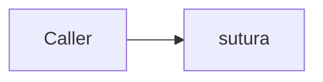

# Publishing the docs

Every version of this site stays published. `main` has a directory, each release has its own,
and a URL somebody cited a year ago still resolves to the text they read.

That versioning is [mike](https://github.com/jimporter/mike)'s job, not ours.
`.github/workflows/docs.yml` builds the site with mkdocs-material and hands it to mike, which
owns the `gh-pages` branch: the version directories, `versions.json`, the root redirect and the
`.nojekyll` marker. The version selector in the header is Material's own, driven by
`extra.version.provider: mike` in `mkdocs.yml`.

Both tools come from the pinned nixpkgs through `nix run .#mkdocs` and `nix run .#mike`, so the
site is built by the same versions CI uses and there is no pip or npm anywhere in the path.

## The layout mike produces

```text
gh-pages/
  index.html      redirect to the default version, written by `mike set-default`
  versions.json   the list the header's version selector reads
  .nojekyll       Pages runs Jekyll over a branch, and Jekyll drops `_`-prefixed paths
  latest/         alias, moved onto each release - HTML redirects, one per page
  0.2.0/
  0.1.0/
  main/           the development docs, overwritten on every push to main
```

| Event | Deploys | Alias |
| --- | --- | --- |
| push to `main` | `main/` | none. `latest` stays pinned to the newest release |
| push of a `v*` tag | `<version>/`, the `v` stripped | `latest` moves onto it, and the root redirect follows |
| `workflow_dispatch` from `main` | `main/` | none |
| pull request | nothing | builds with `--strict`, so a broken link or an orphan page fails the PR |

Nothing deletes a version directory: neither the workflow nor mike is asked to, and the publish
never force-pushes. A concurrent publish makes the job fail rather than overwrite, because a
failed job is recoverable and a deleted version is not.

The root redirect points at `latest` once a release exists. Before the first release there is no
`latest`, so the workflow sets the default to `main` - the site has a working root from the very
first deployment rather than after the first tag.

## The one repository setting

Publishing works from a cold start: mike creates `gh-pages` itself when it is absent. *Serving*
needs one manual step that no workflow can perform. In **Settings -> Pages -> Build and
deployment**:

- **Source: Deploy from a branch**
- **Branch: `gh-pages`, folder `/ (root)`**

Then the site answers at <https://telekom.github.io/sutura/>.

Two things about that:

- **The branch has to exist first.** The dropdown lists only branches that are already there, so
  let the `docs` workflow run once before looking for `gh-pages` in it. A push to `main` touching
  any documentation path does it, and so does a manual `workflow_dispatch`.
- **Not "GitHub Actions".** That source serves one uploaded artifact as the whole site: a single
  current version, no history, no version directories. It is also the source that fails a
  deployment with a bare `HttpError: Not Found` while Pages is switched off. The branch source
  has neither property - the publish succeeds whether Pages is on or not, and switching it on
  afterwards makes everything already on the branch visible at once.

Until the setting is made, versions accumulate on the branch and the site answers nothing. That
is a visible, recoverable state, which is why the workflow does not fail on it.

## Diagrams

Mermaid works. Fence a diagram and Material renders it:

````text

````

It is Material's own SuperFences integration rather than the mermaid2 plugin, because that
integration hands mermaid the active colour scheme - a bare CDN import leaves every diagram
stuck in light mode.

Material does not bundle the mermaid library. Its bundle loads it from a public CDN at runtime,
so a diagram does not render for a reader with no direct egress; the fence degrades to a code
block. No page should depend on a diagram to be understood until mermaid is vendored under
`docs/assets`.

## Brand assets

`docs/css/telekom.css` makes Telekom magenta (`#E20074`) the Material `custom` primary and
accent. It is deliberately small: the header, links and hover states come from four variables,
and the two colour schemes differ only because `#E20074` clears WCAG AA on Material's light
background and not on its dark one. The ratios are recorded next to each value.

Two slots are **empty**, because the T and the wordmark are trademarks and no asset with
verifiable provenance was to hand. Nothing is approximated; drop the official files in and add
the two lines:

| Slot | Drop the official file at | Then add to `mkdocs.yml` under `theme:` |
| --- | --- | --- |
| Header mark | `docs/assets/logo.svg` | `logo: assets/logo.svg` |
| Favicon | `docs/assets/favicon.svg` | `favicon: assets/favicon.svg` |

Until then Material uses its own mark, which is a working default rather than a broken image.
`cargo xtask check-docs` validates whichever of those keys is present, so a path that stops
resolving fails a gate instead of silently rendering nothing.

TeleNeo, the brand face, is not shipped: it is licensed, this repository has no right to
redistribute it, and linking a font CDN would break the self-contained rule. Material's own font
stack is used instead.

## Running it by hand

```bash
mkdocs build --clean --strict     # render to ./site
mkdocs serve                      # live reload on http://127.0.0.1:8000
```

`--strict` is not optional in CI and should not be optional locally either: it is what turns a
dead link, an orphan page and a bad anchor into a failure.

To deploy a version by hand - CI normally does this - mike needs the branch and a git identity:

```bash
git fetch origin gh-pages:gh-pages || true
mike deploy --update-aliases --alias-type=redirect 0.2.0 latest
mike set-default latest
mike list                         # what is published
```

`--alias-type=redirect` is not optional and is not mike's default. By default an alias is a git
**symlink**, and GitHub Pages does not resolve one: `latest/` would serve the text `0.2.0` rather
than the documentation. `redirect` writes a real HTML redirect for every page instead, so
`latest/publishing/` lands on `0.2.0/publishing/` and not merely on the version root.

Add `--push` to send it to the remote. Without `--push` mike only writes the local `gh-pages`
branch, which is the safe way to see what a deployment would contain.
