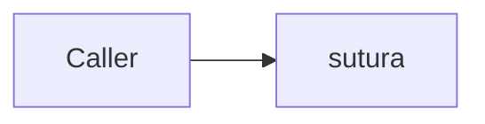

# Publishing the docs

The site holds `main` and one version for each release. A release URL somebody cited a year ago
still resolves to the text they read.

[mike](https://github.com/jimporter/mike) publishes the versions. `.github/workflows/docs.yml`
builds the site with mkdocs-material and hands it to mike. mike owns the `gh-pages` branch: the
version directories, `versions.json`, the root redirect and the `.nojekyll` marker. The header's
version selector is Material's own, and `extra.version.provider: mike` in `mkdocs.yml` drives it.

Both tools come from pixi's isolated `docs` environment. A local build therefore uses the versions
that CI uses, and there is no pip and no npm in the path.

## The layout mike produces

```text
gh-pages/
  index.html      redirect to the default version, written by `mike set-default`
  versions.json   the list the header's version selector reads
  .nojekyll       Pages runs Jekyll over a branch, and Jekyll drops `_`-prefixed paths
  latest/         alias of main/ - HTML redirects, one per page
  0.2.0/          a release, the tag's `v` dropped
  0.1.0/
  main/           overwritten by a push to main that touches the docs
```

| Event                           | Deploys                        | Alias                                                                   |
| ------------------------------- | ------------------------------ | ----------------------------------------------------------------------- |
| push to `main`                  | `main/`                        | `latest` moves onto it, and the root redirect follows                   |
| push of a `v*` tag              | `<version>/`, the `v` stripped | none. A release never moves `latest`                                    |
| `workflow_dispatch` from `main` | `main/`                        | `latest`, as for a push                                                 |
| pull request                    | nothing                        | builds with `--strict`, so a broken link or an orphan page fails the PR |

A deploy of `main` deletes every version directory that is neither `main` nor a release. No other
deploy deletes one. The publish never force-pushes. A concurrent publish makes the job fail, and the
publish does not overwrite.

`latest` is the main branch and `X.Y.Z/` is a release. The root redirect points at `latest`. If a
release tag is published before main is published for the first time, the root redirect points at
the directory of that release. The site therefore has a working root from the first deployment.
Release directories keep the form `0.6.1/`, without the `v` of the tag, so every link that is
already published still resolves.

## The one repository setting

Publishing works from a cold start, because mike creates `gh-pages` itself when it is absent.
*Serving* needs one manual step that no workflow can do. In **Settings -> Pages -> Build and
deployment**:

- **Source: Deploy from a branch**
- **Branch: `gh-pages`, folder `/ (root)`**

The site then answers at <https://telekom.github.io/sutura/>.

!!! warning "The branch has to exist first"

    The dropdown lists only branches that are already there, so let the `docs` workflow run once
    before you look for `gh-pages` in it. A push to `main` that touches any documentation path does
    it, and so does a manual `workflow_dispatch`.

Do not pick **GitHub Actions** as the source. It serves one uploaded artifact as the whole site: one
current version, no history, no version directories. It is also the source that fails a deployment
with a bare `HttpError: Not Found` while Pages is switched off. The branch source has neither
property, so the publish succeeds whether Pages is on or not.

Until the setting is made, versions accumulate on the branch and the site answers nothing. That
state is visible and recoverable, which is why the workflow does not fail on it.

## Diagrams

Fence a diagram as `mermaid` and Material renders it:

````text

```mermaid
graph LR
  A[Caller] --> B[sutura]
```
````

This is Material's own SuperFences integration and not the mermaid2 plugin, because that
integration gives mermaid the active colour scheme. A bare CDN import leaves every diagram stuck in
light mode.

!!! warning "Mermaid is not bundled"

    Material's bundle loads the mermaid library from a public CDN at runtime, so a diagram does not
    render for a reader with no direct egress, and the fence degrades to a code block.

## Brand assets

`docs/css/telekom.css` makes Telekom magenta (`#E20074`) the Material `custom` primary, with a
darker or lifted shade of it as the accent. Eight `--md-*` variables set the header, links and hover
states. The two colour schemes differ only because `#E20074` clears WCAG AA on Material's light
background and not on its dark background.

An original mark fills both image slots, and no Telekom trademark is used:

| Slot        | File                                          | `mkdocs.yml` key              |
| ----------- | --------------------------------------------- | ----------------------------- |
| Header mark | `docs/assets/sutura.svg`                      | `logo: assets/sutura.svg`     |
| Favicon     | `docs/assets/favicon.svg`, plus `favicon.png` | `favicon: assets/favicon.svg` |

The mark is a hexagon cut into two congruent halves whose seam never closes. *Sutura* means a seam,
the hexagon is the ports-and-adapters shape, and the seam is one straight, full-bleed channel. Each
half is the other rotated 180 degrees about the centre, so the optical weight is equal by
construction. The favicon is drawn separately and is not scaled, because the primary mark becomes
unclear at 16px.

The **T and the wordmark are deliberately absent.** They are trademarks, nothing here approximates
one, and no asset without verifiable provenance is used. TeleNeo, the brand face, is licensed and
cannot be redistributed here, and linking a font CDN would break the self-contained rule, so the
site uses Material's own font stack instead.

Material's header carries the brand magenta in *both* colour schemes, so a magenta mark on it is
invisible. `brightness(0) invert(1)` flattens the artwork and turns it white, so it matches the
header text. This is one filter, not a second white-only file to keep in sync.

## Running it by hand

CI publishes the docs automatically on merge to `main` and on a `v*` tag, so you do not normally
need to run it by hand.

Render the site to `site/`:

```bash
just docs
```

Serve it with live reload on <http://127.0.0.1:8000>:

```bash
just docs-serve
```
